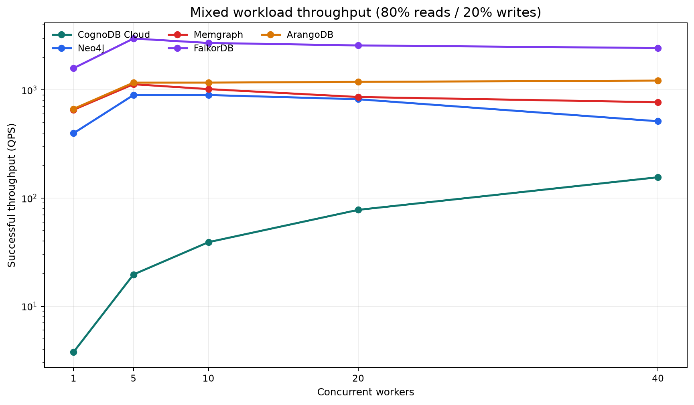
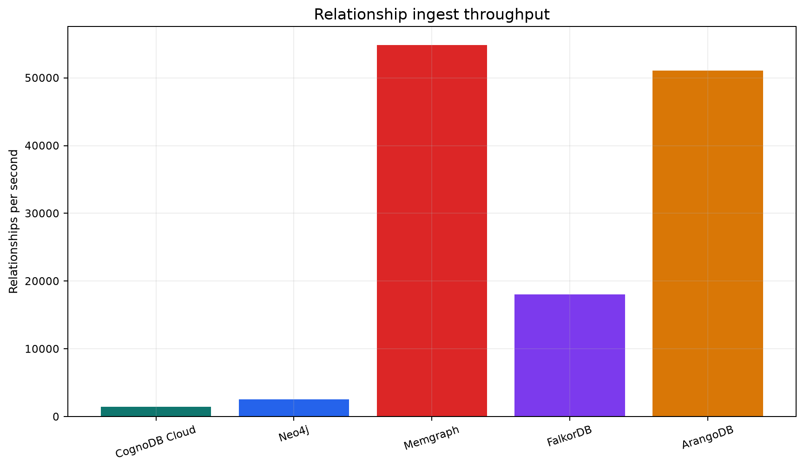
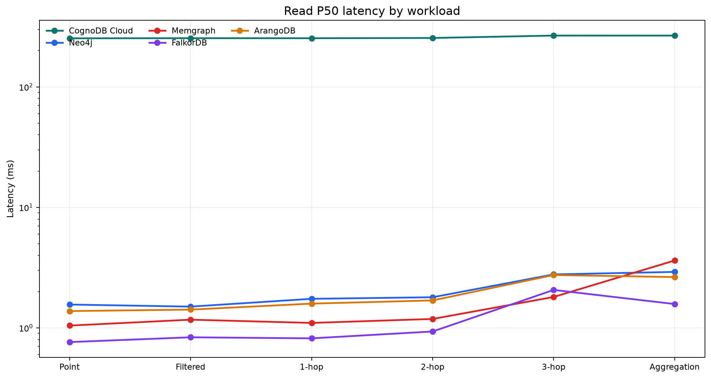
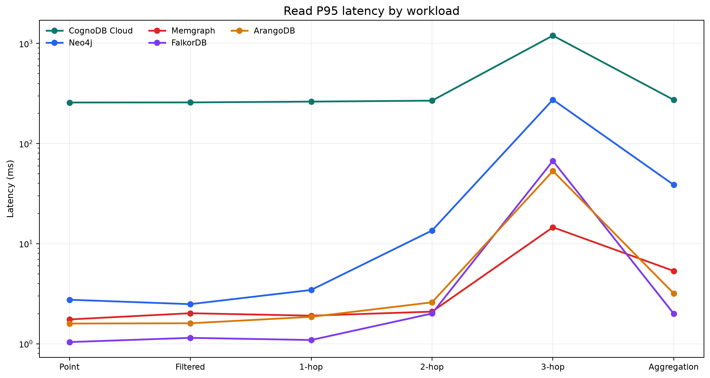
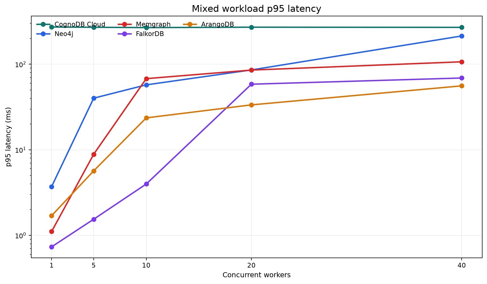

# Five Graph Databases, One Graph, Same Workloads

An auditable benchmark of CognoDB Cloud, Neo4j, Memgraph, FalkorDB, and ArangoDB using
the directed Stanford SNAP Wiki-Vote graph. The harness creates deterministic fixtures once,
replays the same logical workloads everywhere, and keeps raw measurements and failures visible.

> **Important interpretation note:** CognoDB was measured remotely over WAN/TLS; the other
> databases were reached through local Docker loopback. CognoDB latency is therefore
> end-to-end client-observed cloud latency, not engine-isolated latency. Its diagnostic
> transport floor was about 247 ms; this diagnostic was not subtracted from any result.

## Benchmark at a glance

| Item | Frozen final campaign |
| --- | ---: |
| Dataset | Stanford SNAP Wiki-Vote |
| Nodes / relationships | 7,115 / 103,689 |
| Databases | 5 |
| Read rounds | 3 |
| Warm-up / measured iterations | 30 / 200 per workload per round |
| Read samples | 18,000 measured + 900 warm-up |
| Mixed workload | 80% reads / 20% writes |
| Mixed operations | 1,559,631 |
| Concurrency | 1 / 5 / 10 / 20 / 40 |
| Campaign | `final-20260820T022802Z` |
| Configuration fingerprint | `bf5c21d0bce4043d0c453d41497d7c375e685b28ee254714521e4a9c2879b162` |

## TL;DR

- Every platform received the same 7,115-node, 103,689-relationship graph, deterministic
  fixtures, indexed properties, and canonical workload definitions.
- The read campaign contains 18,000 measured operations after warm-up; all measured reads
  succeeded and passed the independent Python oracle.
- Local engines generally produced low single-digit millisecond median reads in this setup.
  Three-hop p95 latency exposed strong sensitivity to graph path cardinality.
- The mixed campaign measured about 1.56 million operations. FalkorDB had the highest observed
  local mixed QPS in this configuration; this is not a universal database ranking.
- CognoDB throughput increased from 3.8 to 155.8 successful QPS as concurrency increased from
  1 to 40, while request latency remained near its remote transport floor.
- Neo4j used 384 MiB rather than the 256 MiB target. That resource-parity deviation, the
  managed-vs-local network difference, and the unenforceable local storage quota are retained.



## What was measured

### Dataset and graph model

The source is the [Stanford SNAP wiki-Vote directed graph](https://snap.stanford.edu/data/wiki-Vote.html).
The canonical model is:

```text
(:User {id: integer, bucket: integer})
(:User)-[:VOTED_FOR]->(:User)
```

`bucket = id % 32` is a deterministic synthetic property added solely to support an equivalent
indexed filter and group-by workload. It does not alter graph topology. Dataset metadata,
checksums, and the fixed seed are in [data/metadata/wiki_vote.json](data/metadata/wiki_vote.json).

### Workloads

The six read workloads are point lookup, filtered indexed lookup, exact outgoing 1-hop, 2-hop,
and 3-hop path counts, and aggregation by `bucket`. The mixed workload combines the canonical
point lookup read with a write that increments only `benchmark_counter`; it never changes graph
topology, `id`, or `bucket`.

All adapters validate returned values against the independent Python canonical oracle before
measurement. Query-language translations and result semantics are documented in
[docs/QUERY_EQUIVALENCE.md](docs/QUERY_EQUIVALENCE.md).

### Methodology

- Read: 3 rounds, 30 warm-up iterations, then 200 measured iterations per workload per round;
  p50 and p95 are reported from 600 samples per database/workload.
- Mixed: 15-second warm-up followed by 60 seconds measured at concurrency 1, 5, 10, 20, and 40.
- Fixtures were generated once from seed `20260319` and replayed in the same order everywhere.
- Connection setup, fixture selection, logging, and serialization are outside the per-operation
  timer. Results are raw client-observed wall-clock measurements.
- Transport baselines are diagnostic only. They were not subtracted from latency, and local
  databases were not artificially delayed.

## Platforms and resources

| Platform | Deployment | CPU | RAM | Footprint after load* | Status |
| --- | --- | ---: | ---: | --- | --- |
| CognoDB Cloud | Managed cloud | 0.5 burstable* | 256 MiB* | not observable | advertised |
| **Neo4j** | **Local Docker** | **0.5** | **384 MiB** | **545,976,320 B (520.7 MiB)** | **parity deviation** |
| Memgraph | Local Docker | 0.5 | 256 MiB | 65,601,536 B (62.6 MiB) | controlled |
| FalkorDB | Local Docker | 0.5 | 256 MiB | 1,699,840 B (1.6 MiB) | controlled |
| ArangoDB | Local Docker | 0.5 | 256 MiB | 22,249,472 B (21.2 MiB) | controlled |

`*` CognoDB values are assignment-advertised managed-service resources; runtime resources and
storage footprint are not observable. Local CPU and memory limits were verified from Docker
inspection. Local footprint is observed after load and is usage, not an allocated limit.
Neo4j could boot at 256 MiB but could not reliably ingest the complete canonical dataset in
bounded low-memory testing, so its measured 384 MiB allocation is an explicit resource-parity
deviation. Docker Desktop could not reliably enforce 1 GiB per-volume quotas, so these observed
footprints are not enforced 1 GiB limits. The full resource and environment records are in the
[frozen campaign metadata](results/final/final-20260820T022802Z/metadata/).

The client and local containers shared a Windows 11 / Docker Desktop host. Background activity,
WSL, Docker scheduling, and host noise may affect local measurements.

## Results

### Ingest

Parameterized batches of 1,000 were used; schema setup time is excluded. Total wall-clock load
includes node and relationship loading.

| Database | Nodes/sec | Relationships/sec | Total ingest (s) |
| --- | ---: | ---: | ---: |
| CognoDB Cloud | 2,493.26 | 1,456.31 | 74.05 |
| Neo4j | 280.30 | 2,547.83 | 66.08 |
| Memgraph | 60,800.01 | 54,837.67 | 2.01 |
| FalkorDB | 154,530.13 | 18,012.75 | 5.80 |
| ArangoDB | 56,902.38 | 51,079.04 | 2.16 |



Memgraph and ArangoDB recorded high relationship ingest throughput in the tested local
configuration. FalkorDB recorded especially high node ingest but lower relationship throughput
than those two systems. CognoDB ingest includes remote client interactions, while Neo4j used a
different memory allocation; these results are descriptive, not a claim about internal causes.

### Read latency

Each cell is `p50 / p95` in milliseconds, across 600 measured samples. The logarithmic chart
axes preserve the scale difference between the remote and local network paths.

| Database | Point | Filtered | 1-hop | 2-hop | 3-hop | Aggregation |
| --- | ---: | ---: | ---: | ---: | ---: | ---: |
| CognoDB Cloud | 253.057 / 257.363 | 253.581 / 257.856 | 253.400 / 262.702 | 254.714 / 268.572 | 266.641 / 1,200.260 | 266.595 / 273.261 |
| Neo4j | 1.560 / 2.754 | 1.499 / 2.486 | 1.741 / 3.447 | 1.793 / 13.534 | 2.776 / 274.629 | 2.912 / 38.691 |
| Memgraph | 1.043 / 1.750 | 1.168 / 2.018 | 1.098 / 1.908 | 1.185 / 2.093 | 1.803 / 14.583 | 3.622 / 5.339 |
| FalkorDB | 0.761 / 1.039 | 0.834 / 1.145 | 0.818 / 1.090 | 0.932 / 2.005 | 2.063 / 67.195 | 1.575 / 1.996 |
| ArangoDB | 1.377 / 1.592 | 1.416 / 1.602 | 1.588 / 1.857 | 1.688 / 2.593 | 2.742 / 53.223 | 2.638 / 3.182 |





Simple and indexed local operations commonly have low single-digit medians. Three-hop p95 is
substantially larger than p50 for several platforms. That is a topology-sensitive tail result,
not evidence of one universal ranking, and CognoDB's values include WAN/TLS transport.

### Concurrent mixed workload

Successful QPS is reported for an 80% read / 20% write workload. These are end-to-end client
throughput values under the tested resource and network configuration.

| Database | C1 | C5 | C10 | C20 | C40 |
| --- | ---: | ---: | ---: | ---: | ---: |
| CognoDB Cloud | 3.764 | 19.630 | 39.061 | 77.773 | 155.769 |
| Neo4j | 397.580 | 897.203 | 897.473 | 820.301 | 513.378 |
| Memgraph | 655.201 | 1,129.147 | 1,018.026 | 860.173 | 769.920 |
| FalkorDB | 1,588.141 | 2,989.055 | 2,720.000 | 2,580.472 | 2,441.954 |
| ArangoDB | 668.017 | 1,168.264 | 1,168.731 | 1,187.568 | 1,220.328 |




Observed shapes are configuration-specific: CognoDB throughput scaled with concurrency while
per-request latency stayed near its remote floor; Neo4j rose through concurrency 5-10 and then
declined; Memgraph peaked around 5; FalkorDB peaked around 5 and stayed high; ArangoDB increased
comparatively steadily through 40 while latency rose. These observations should not be generalized
beyond this graph, client, resource budget, and network arrangement.

### Failures

Failures were retained and were not retried away. All other final mixed operations succeeded.
Every QPS cell not listed below has a failure count and rate of `0` and `0%`, respectively.

| Database | Concurrency | Operation | Count | Rate in attempted writes | Classification |
| --- | ---: | --- | ---: | ---: | --- |
| Neo4j | 40 | mixed write | 1 | 0.0162% (1 / 6,169) | transaction memory-pool OOM |
| Memgraph | 40 | mixed write | 2 | 0.0216% (2 / 9,240) | transaction conflicts |

The read campaign had zero measured failures. The audit records all three mixed failures and the
raw operation rows.

## Tail latency and graph topology

The integrity audit found that the large three-hop p95 values occur across all three rounds and
cluster around high-path-count fixtures. Fixture `457` has a canonical three-hop path count of
`1,211,397`; it is the highest-path-count example retained in the audit evidence. The evidence
supports a correlation between path cardinality and tail events. It does not establish a
database-internal architectural cause.

## Fairness and limitations

### Controlled

The harness held constant the graph topology, deterministic fixtures, logical workload
semantics, equivalent `id` and `bucket` indexes, client machine, warm-up treatment, measurement
window, and failure accounting. Memgraph, FalkorDB, and ArangoDB shared the observed 0.5 CPU /
256 MiB local container limits.

### Not fully controlled

CognoDB was a managed remote service while competitors were local Docker containers. Neo4j used
384 MiB rather than 256 MiB. A 1 GiB Docker Desktop storage quota was not reliably enforceable.
Windows/Docker Desktop host noise and managed-vs-self-hosted operational differences remain.
FalkorDB's recorded preflight and post-workload repair history is disclosed in the final audit.

Read the deeper [fairness methodology](docs/FAIRNESS.md) and [query equivalence audit](docs/QUERY_EQUIVALENCE.md).

### What this benchmark does not prove

It does not establish a universal database ranking, production-scale or billion-edge throughput,
HA or cluster behavior, distributed graph performance, backup/recovery quality, operational
maturity, cost efficiency, multi-region performance, engine-only CognoDB latency, arbitrary
topology performance, or total cost of ownership.

## Reproducing the benchmark

The final campaign is frozen in this repository. The commands below are the actual CLI and test
entry points; running a new benchmark requires database access and is intentionally not part of
the publication/report pass.

```bash
git clone <repository-url>
cd graphdb-cloud-benchmark
python -m venv .venv
# macOS/Linux: source .venv/bin/activate
# Windows PowerShell: .venv\Scripts\Activate.ps1
python -m pip install -e ".[dev]"
cp .env.example .env                 # PowerShell: Copy-Item .env.example .env
python -m graphbench dataset prepare
python -m graphbench doctor
python -m pytest
python -m ruff check .
python -m graphbench report
```

The report command reads the frozen campaign and writes the five charts in `charts/`; it does not
contact any database. `make report` is an equivalent convenience target where GNU Make is
available. A full new run uses `make benchmark-final` or
`python -m graphbench benchmark --all --profile final` after local services and credentials are
configured. Do not use a dry run or a different campaign when reproducing the published tables.

### Database setup

- **CognoDB Cloud:** Create the assignment's free `c0` instance and add
  `COGNODB_URI`, `COGNODB_USER=cognodb`, and `COGNODB_PASSWORD` to `.env`.

- **Neo4j:** Add a local `NEO4J_PASSWORD` to `.env`, then run
  `docker compose -f docker/neo4j-compose.yaml up -d`.

- **Memgraph:** No cloud account is required. Run
  `docker compose -f docker/memgraph-compose.yaml up -d`.

- **FalkorDB:** No cloud account is required. Run
  `docker compose -f docker/falkordb-compose.yaml up -d`.

- **ArangoDB:** Add a local `ARANGODB_PASSWORD` to `.env`, then run
  `docker compose -f docker/arangodb-compose.yaml up -d`.

Run `python -m graphbench prepare --database <name>` and
`python -m graphbench validate --database <name>` for each configured platform before a new
measurement. Credentials are loaded from `.env` and are never written to results.

## Audit the results

The published tables and charts come from the machine-readable frozen campaign, not from a
hand-edited performance narrative:

- [campaign manifest](results/final/final-20260820T022802Z/campaign_manifest.json) — campaign ID,
  fingerprint, profile, completeness, and freeze status;
- [raw read measurements](results/final/final-20260820T022802Z/raw/read_raw.jsonl), plus
  [mixed summaries](results/final/final-20260820T022802Z/summaries/mixed_summary.json) and the
  [mixed failure index](results/final/final-20260820T022802Z/mixed_errors.json). The complete
  per-operation mixed JSONL is available as a losslessly compressed
  [GitHub Release asset](https://github.com/vishnuuu07/graphdb-cloud-benchmark/releases/download/raw-evidence-final-20260820T022802Z/final-20260820T022802Z-mixed_raw.tar.gz).
  Verify the archive with SHA-256 `708758117047431297c8bbe20e0959125308efb1d4e360626b5406ee1d520486`;
  after extraction, verify `mixed_raw.jsonl` with SHA-256
  `5921e9b6efe8d3bbb751f918857421b3c011c6d620658885a1abb8f178bfe612`;
- [summaries](results/final/final-20260820T022802Z/summaries/) — generated p50/p95/QPS tables;
- [integrity audit](results/final/final-20260820T022802Z/audit/integrity_audit.md) and
  [audit evidence](results/final/final-20260820T022802Z/audit/integrity_audit.json);
- [resource observations](results/final/final-20260820T022802Z/metadata/resource_observations.json)
  and [fairness manifest](results/final/final-20260820T022802Z/metadata/fairness_manifest.json).

The audit independently reconciled raw rows to summaries, retained measured failures, checked
query equivalence against the Python oracle, and passed with results frozen. The configuration
fingerprint links the final inputs and published artifacts.

## Repository structure

```text
graphbench/   adapters, canonical workloads, oracle, runners, and CLI
configs/      benchmark and platform configuration
docker/       local database Compose files
data/         processed graph, deterministic fixtures, and metadata
results/      frozen raw measurements, summaries, audit, and observations
charts/       deterministic publication charts generated from frozen summaries
docs/         fairness and query-equivalence methodology
tests/        unit and harness integrity tests
```

## Adding another database

Implement the database-specific adapter contract, map its native query language to the canonical
workloads, and keep fixture selection and result semantics in the shared harness. The independent
Python oracle and preflight validation must pass before any measurement is publishable.

## License and dataset attribution

The graph is attributed to the [Stanford SNAP dataset collection](https://snap.stanford.edu/data/)
and its [wiki-Vote source page](https://snap.stanford.edu/data/wiki-Vote.html). The checked-in
metadata preserves the source URL and checksum. The harness is released under the [MIT License](LICENSE).
